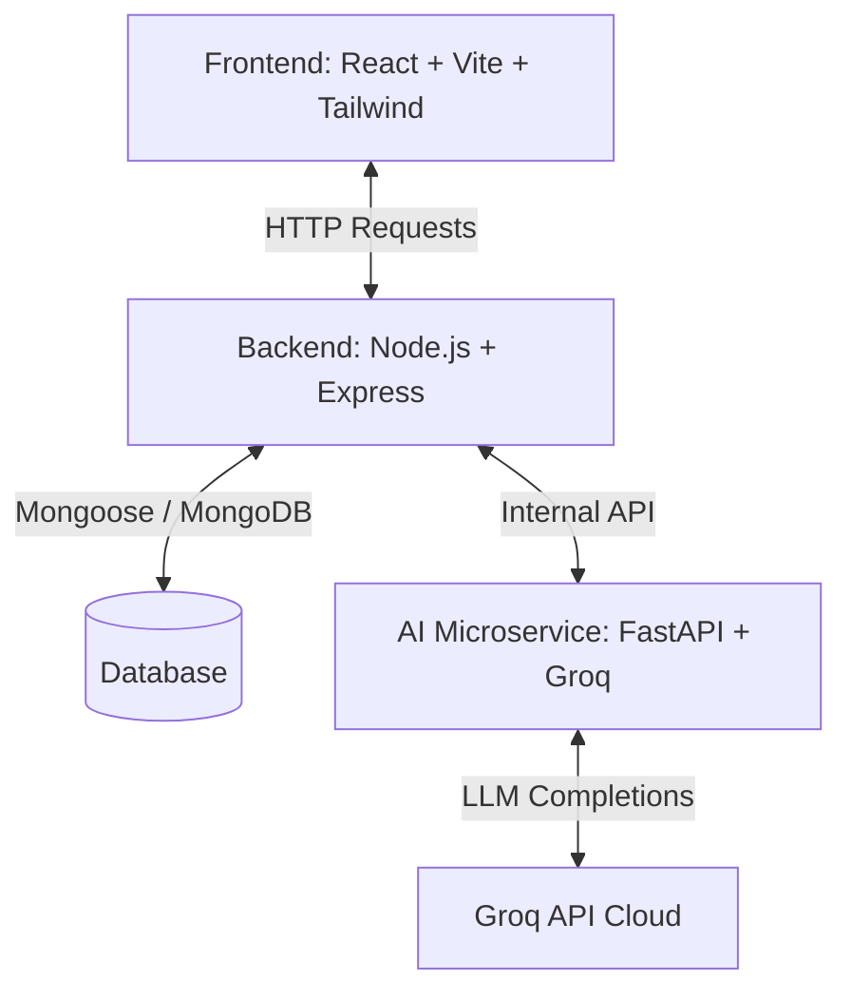

# 🔍 AImposter

**AImposter** is a suspenseful, interactive detective role-playing game where you step into the shoes of a Detective. A crime has occurred, and you must interrogate multiple Indian suspects to uncover the truth. Among the suspects, one is the **Imposter**—who will lie, manipulate, and deflect suspicion to cover up their tracks—while the others are **Innocents** who will tell the truth. 

Analyze testimonies, compare their stories, track your interrogations, and make your accusation to solve the mystery!

---

## 🛠️ Tech Stack & Architecture

AImposter is built with a decoupled three-tier architecture:



### 1. Frontend (Vite + React)
- **Vite & React 19**: Lightning-fast, modern reactive user interface.
- **Tailwind CSS v4**: Beautiful, custom styled components featuring warm-stone and classic paper glassmorphic elements matching a Case File aesthetic.
- **Anime.js**: Micro-animations and sleek transitions.
- **React Type Animation**: Dynamic typewriter typing effects.
- **Axios**: Promised-based HTTP requests to the backend server.

### 2. Backend Service (Express + MongoDB)
- **Node.js & Express**: Handles game session logic, routes, and coordinates communications.
- **MongoDB & Mongoose**: Stores game history, incident reports, suspect personas, and player-character chat logs.
- **CORS & Cookie Parser**: Secure session-based request headers.

### 3. AI Service (FastAPI + Groq)
- **Python & FastAPI**: Lightweight, asynchronous microservice handling LLM calls.
- **Groq Cloud API**: Utilizes the super-fast **`llama-3.3-70b-versatile`** model for E2E scenario generation (backstory, suspects, bios, secret truth) and real-time character roleplay.
- **Pydantic**: Data schema validation.

---

## ⚙️ Environment Variables Setup

You will need to set up three separate `.env` files in each service directory.

### 1. AI Service (`ai_service/.env`)
Create a `.env` file inside the `ai_service/` folder:
```env
GROQ_API_KEY=your_groq_api_key_here
```

### 2. Express Backend (`backend/.env`)
Create a `.env` file inside the `backend/` folder:
```env
PORT=8000
MONGODB_URI=your_mongodb_connection_uri_here
FASTAPI_SERVICE_URL=http://127.0.0.1:8001
```

### 3. React Frontend (`frontend/.env`)
Create a `.env` file inside the `frontend/` folder:
```env
VITE_API_URL=http://localhost:8000
```

---

## 🚀 How to Wire It Up (Getting Started)

Follow these steps to set up and run the project locally. Start the services in the following order:

### Step 1: Start the AI Service
1. Open a terminal and navigate to the `ai_service` folder:
   ```bash
   cd ai_service
   ```
2. Create and activate a Python virtual environment:
   ```bash
   # On macOS/Linux:
   python3 -m venv .venv
   source .venv/bin/activate

   # On Windows (PowerShell):
   python -m venv .venv
   .venv\Scripts\Activate.ps1
   ```
3. Install the required Python packages:
   ```bash
   pip install -r requirements.txt
   ```
4. Start the FastAPI microservice:
   ```bash
   uvicorn main:app --host 127.0.0.1 --port 8001 --reload
   ```
   *The AI service will now be running at `http://127.0.0.1:8001`.*

### Step 2: Start the Express Backend
1. Open a second terminal and navigate to the `backend` folder:
   ```bash
   cd backend
   ```
2. Install npm packages:
   ```bash
   npm install
   ```
3. Start the backend developer server:
   ```bash
   npm run dev
   ```
   *The backend server will start at `http://localhost:8000`.*

### Step 3: Start the React Frontend
1. Open a third terminal and navigate to the `frontend` folder:
   ```bash
   cd frontend
   ```
2. Install npm packages:
   ```bash
   npm install
   ```
3. Run the frontend build or start the Vite development server:
   ```bash
   npm run dev
   ```
   *Vite will start the client interface, typically at `http://localhost:5173` (check terminal output).*

---

## 🎮 Gameplay Features

1. **Preset Themes**: Pick from 8 pre-crafted mysteries including Paranormal/Haunted, Palace secrets, train robbery, and biological sabotage.
2. **Custom Themes**: Type any custom theme (e.g. *"A theft at a royal wedding in Jaipur"*) and the AI will auto-generate an immersive scenario.
3. **Interrogation Badges**: Suspect cards keep track of how many questions you've asked them (e.g., `💬 Interrogated (4)`).
4. **Optimistic Chat**: Dialogue renders immediately when sending a message for smooth interrogation flow.
5. **Accusation Hub**: Accuse any suspect. If you find the Imposter, you win. The actual sequence of events (`truth`) is revealed at the end!
